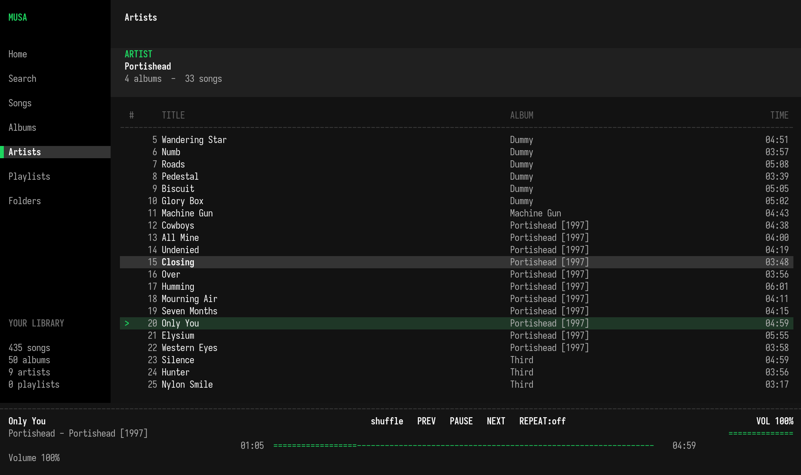

# Musa

A fast, keyboard-driven terminal music player written in Rust.

Musa scans local music folders, reads track metadata, organizes the library by songs, albums, and artists, and provides playback, search, playlists, shuffle, repeat, and filesystem browsing without leaving the terminal.



## Features

* Local music library scanning with progress reporting
* Metadata extraction from audio tags, with filename and directory fallbacks
* Songs, albums, artists, playlists, recent tracks, and folder views
* Search across playlists, artists, albums, tracks, and file paths
* Playback controls: play, pause, seek, next, previous, and volume
* Shuffle and repeat modes: off, all, and one
* Persistent library folders, playlists, and theme settings
* Dark and light terminal themes
* Background library scanning, keeping the interface responsive
* Direct playback from the folder browser without adding a directory to the library

## Recognized audio extensions

Musa scans files with the following extensions:

```text
flac, mp3, ogg, oga, wav, m4a, m4b, mp4, aac
```

Actual decoding support depends on the codecs enabled by the audio backend.

## Requirements

* A recent stable Rust toolchain
* A working system audio output device
* A terminal supporting alternate screens and ANSI colors
* Minimum terminal size: `72 × 24`

## Installation

Clone the repository and build a release binary:

```bash
git clone https://github.com/Sn0vvl4nd3R/musa.git
cd musa
cargo build --release
```

The resulting executable will be located at:

```text
target/release/musa
```

You can also run Musa directly through Cargo:

```bash
cargo run --release
```

## Getting started

1. Start Musa.
2. Open the **Folders** view with `7` or `o`.
3. Navigate to a directory containing music.
4. Press `a` to add the selected directory as a library root.
5. Wait for the scan to finish.
6. Browse songs, albums, artists, or search with `/`.
7. Select an item and press `Enter` to open or play it.

When no library folders are configured, Musa opens the folder browser on startup.

## Keyboard controls

Press `?` inside Musa to open the built-in help screen.

### Navigation

| Key                     | Action                                                           |
| ----------------------- | ---------------------------------------------------------------- |
| `1` … `7`               | Open Home, Search, Songs, Albums, Artists, Playlists, or Folders |
| `o`                     | Open Folders                                                     |
| `/`                     | Start search; in Folders, open filesystem root `/`               |
| `↑` / `↓`, `j` / `k`    | Move selection                                                   |
| `Page Up` / `Page Down` | Move ten rows                                                    |
| `g` / `G`               | Select first / last item                                         |
| `Enter`                 | Open the selected item or start playback                         |
| `Esc`                   | Close a detail view or modal; return toward Home                 |
| `?`                     | Open or close help                                               |
| `q`, `Ctrl+C`, `Ctrl+Q` | Quit                                                             |

### Playback

| Key       | Action                                  |
| --------- | --------------------------------------- |
| `Space`   | Play or pause                           |
| `n` / `p` | Next / previous track                   |
| `[` / `]` | Seek backward / forward by five seconds |
| `+` / `-` | Increase / decrease volume              |
| `x`       | Toggle shuffle                          |
| `r`       | Cycle repeat mode                       |
| `t`       | Toggle dark and light themes            |
| `u`       | Rescan saved library folders            |

### Playlists

| Context                                   | Key     | Action                              |
| ----------------------------------------- | ------- | ----------------------------------- |
| Song, album, artist, or playlist selected | `a`     | Add the selection to a playlist     |
| Playlists                                 | `c`     | Create a playlist                   |
| Playlists                                 | `e`     | Rename the selected playlist        |
| Open playlist                             | `d`     | Remove the selected song            |
| Playlists                                 | `D`     | Delete the selected playlist        |
| Playlist picker                           | `Enter` | Add tracks to the selected playlist |
| Playlist picker                           | `c`     | Create a new target playlist        |

### Folder browser

| Key         | Action                                                   |
| ----------- | -------------------------------------------------------- |
| `←` / `→`   | Switch focus between library roots and directory browser |
| `Enter`     | Open a directory or play a selected audio file           |
| `Backspace` | Go to the parent directory                               |
| `~`         | Open the home directory                                  |
| `a`         | Add the selected directory as a library root             |
| `d`         | Remove the selected library root                         |

## Metadata handling

Musa first attempts to read embedded audio metadata. When tags are missing, it derives metadata from file and directory names.

Examples of recognized filename layouts include:

```text
01 - Track title.mp3
01.02 Track title.flac
Artist - Track title.ogg
```

Album and artist names may also be inferred from a directory structure such as:

```text
Music/
└── Artist/
    └── 2026 - Album/
        ├── 01 - First track.flac
        └── CD2/
            └── 02 - Second track.flac
```

## Configuration

Musa stores its state in plain-text files. The configuration directory is selected in this order:

1. `MUSA_CONFIG_DIR`
2. `$XDG_CONFIG_HOME/musa`
3. `%APPDATA%/musa`
4. `~/.config/musa`

Stored files:

| File            | Purpose                         |
| --------------- | ------------------------------- |
| `libraries.txt` | Saved library root directories  |
| `playlists.txt` | Playlist names and track paths  |
| `theme`         | Current `dark` or `light` theme |

Set a custom configuration directory when testing or running portable instances:

```bash
MUSA_CONFIG_DIR=/path/to/config cargo run --release
```

## Project structure

```text
src/
├── main.rs      # Terminal lifecycle and event loop
├── app.rs       # Application state, navigation, queues, and commands
├── audio.rs     # Audio playback backend
├── library.rs   # Scanning, metadata parsing, and library models
├── storage.rs   # Persistent settings and playlists
└── ui.rs        # Terminal rendering
```

## Main dependencies

* [`crossterm`](https://crates.io/crates/crossterm) — terminal input and rendering
* [`rodio`](https://crates.io/crates/rodio) — audio playback
* [`lofty`](https://crates.io/crates/lofty) — audio metadata parsing
* [`unicode-width`](https://crates.io/crates/unicode-width) — correct terminal text layout

## Development

Run the standard Rust checks before submitting changes:

```bash
cargo fmt --check
cargo clippy --all-targets --all-features -- -D warnings
cargo test
cargo build --release
```

## Known limitations

* Musa currently works with local files only.
* Playlists store file paths, so moved or renamed tracks must be rescanned and may no longer resolve.
* Symlinks are intentionally skipped during library and folder scanning.
* Audio format support can vary depending on the platform and enabled decoder features.

## Contributing

Issues and pull requests are welcome. For substantial changes, open an issue first to discuss the intended behavior and design.
